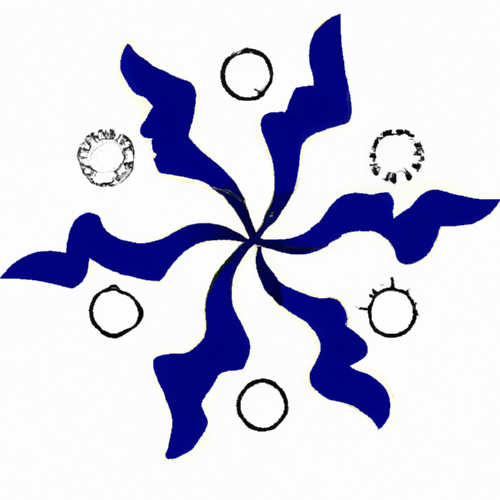

# icm_goapi
A repository containing go structs and helper functions for processing ABB ICM/CMP data from snowflake into a go pipeline. Meant to be used as a basis for other external libraries and go-based packages.

## orm
The primary location for Go-based structs which are representations of ABB ICM entities. 
The `orm` library contains an ICMEntity interface which allows for smoother functionality in the `encoding` library.
Primary ICM Entities (such as a Vendor) are represented by a struct of the same name (i.e. `orm.Vendor`). In cases
where the primary entity is also flagged during the ICM process, the boolean flags are contained within a nested struct
(i.e. `orm.VendorFlags`) in a field called `Flags` on the primary entity.

If it is necessary to create or construct new ICM Entities over time, it is important to understand that both the primary entitiy
_and_ the nested Flag entity satisfy the ICMEntity interface. 

## Encoding
An (amatuerish) attempt at an encoding lib for ICM entities into snowflake SELECT statements. In general, this comes in two flavors: nested and flat.
Marshalling a `orm` entity into a nested query basically consists of constructing a Snowflake SELECT statement which contains an `OBJECT_CONSTRUCT` command
in order to load the nested `Flag` entity.
Marshalling an `orm` entity into a flat SELECT statement simply queries all known fields from the database and returns them in the order they are defined in the struct. 
Roughly equivalent to a `SELECT *` statement.