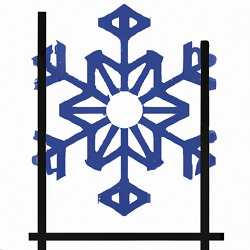

encoding is a library which aids in transporting data from ABB Snowflake platforms into Golang structs.

# Overview
Ths standard go library includes an `encoding` package which provides interfaces shared by other packages that convert
data to and from byte-level and textual representations. The `json` encoder is one of the most commonly used within this
package. Importantly, the `json` package (and others within the `encoding` package) define a format for tagging Go structs
with valid json field names and a short list of options for reading these fields from raw json byte arrays.

Documentation for the json encoding library available at [pkg.go.dev](https://pkg.go.dev/encoding/json). Especially relevant at [Marshal](https://pkg.go.dev/encoding/json#Marshal).

Within the standard library, the json packages allows for the following [tag options](https://pkg.go.dev/encoding/json#Marshal):
- omitempty: specifies that the field should be omitted from the encoding if the field has an empty value, defined as false, 0, a nil pointer, a nil interface value, and any empty array, slice, map, or string.
- string: signals that a field is stored as JSON inside a JSON-encoded string. It applies only to fields of string, floating point, integer, or boolean types.
- ignore field: As a special case, if the field tag is "-", the field is always omitted. Note that a field with name "-" can still be generated using the tag "-,".


## SQL Encoding
Similarly, the `orm` package allows for the creation of `sql:"FieldName"` tags. It is recommended, and required in many
cases, that structs with `sql` tags also have `json` tags. For instance, in Marshalling a struct into a corresponding,
nested SQL SELECT statement, the `json` tags are used as the keys in a call to `OBJECT_CONSTRUCT()`. For instance:

```go
package main

import (
  "github.com/alexander-orban/icm_goapi/encoding"
  "os"
  "reflect"
)

type Entity struct {
  ID         string       `json:"icm-id" sql:"ICM_ID|pk"`
  Name       string       `json:"name-1" sql:"NAME1"`
  Flags      *NestedStruct `json:"flags" sql:"FLAGS"`
  OtherField string       `json:"other-field" sql:"OTHER_FIELD"`
}
type NestedStruct struct {
  Flag1 bool `json:"flag-type-1" sql:"Flag: Type 1"`
  Flag2 bool `json:"flag-type-2" sql:"Flag: Type 2"`
}

func main() {
  t := reflect.TypeOf((*Entity)(nil)).Elem()
  // Allow nested objects within the SELECT query
  qry := encoding.MarshalToSelect(t, "SCHEMA", false)

  os.Stdout.Write([]byte("Nested"))
  os.Stdout.Write(qry)

  // A flat query, roughly equal to a SELECT *
  qry = encoding.MarshalToSelect(t, "SCHEMA", true)
  os.Stdout.Write([]byte("Flat"))
  os.Stdout.Write(qry)
}
```
```text
Output:

Nested
SELECT
    "ICM_ID",
    "NAME1",
    OBJECT_CONSTRUCT(
        'flag-type-1',"Flag: Type 1",
        'flag-type-2',"Flag: Type 2"
    ) AS "FLAGS",
    "OTHER_FIELD"
FROM SCHEMA

Flat
SELECT
    "ICM_ID",
    "NAME1",
    "Flag: Type 1",
    "Flag: Type 2",
    "OTHER_FIELD"
 FROM SCHEMA
```
### Encoding Options
Similar to the `encoding/json` package of standard library, the orm encoder also allows for options in `sql` tags. These
options should be seperated from the SQL field name with a pipe (`|`). Multiple options can be provided, and should be
seperated with a comma.
- `pk`: the `MarshalSelectThis` function returns a query which will select a single ICM Entity from the relevant table.
  The `pk` option marks this field as necessary within the `WHERE` clause to uniquely identify this entity within the relevant
  table.