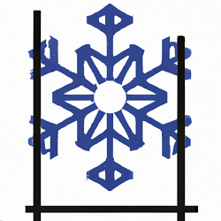

orm is a package which contains both Go representations of ICM Entities and a library for Marshaling these 
representations into SQL select statements.

# Overview
This package contains:
- a Go struct for [bankMaster.go](bankMaster.go)
- a Go struct for [banksUsedBy.go](banksUsedBy.go)
- a Go struct for [billingDocument.go](billingDocument.go)
- a Go struct for [businessPartnerProject.go](businessPartnerProject.go)
- a Go struct for [check.go](check.go)
- a Go struct for [customer.go](customer.go)
- a Go struct for [fiCustomer.go](fiCustomer.go)
- a Go struct for [fiVendor.go](fiVendor.go)
- a Go struct for [invoice.go](invoice.go)
- a Go struct for [paymentRun.go](paymentRun.go)
- a Go struct for [project.go](project.go)
- a Go struct for [purchaseOrder.go](purchaseOrder.go)
- a Go struct for [purchaseOrderProject.go](purchaseOrderProject.go)
- a Go struct for [requisition.go](requisition.go)
- a Go struct for [salesOrder.go](salesOrder.go)
- a Go struct for [salesOrderProject.go](salesOrderProject.go)
- a Go struct for [vendor.go](vendor.go)

## Notes
- When Flags are present on any of the above structs, the primary struct (i.e. [`Vendor`](vendor.go)) contains a Flags 
 field which is constructed of a nested struct (i.e. `VendorFlags`). These nested structs contain only boolean values. 
 Other ICM fields which related to Flags, but are not booleans (i.e. Descriptions or comments), are contained in the 
 Primary struct.
- Each of the above structs (and all nested, `Flag` structs) sastify the ICMEntity interface. This is important, since 
the encoding library relies upon this abstraction to function smoothly.

Additionally, this package contains several shared functions and an interface (called ICMEntity) in [shared.go](shared.go), which is leveraged by the encoding library.
Contained within [shared.go](shared.go) are the following functions: